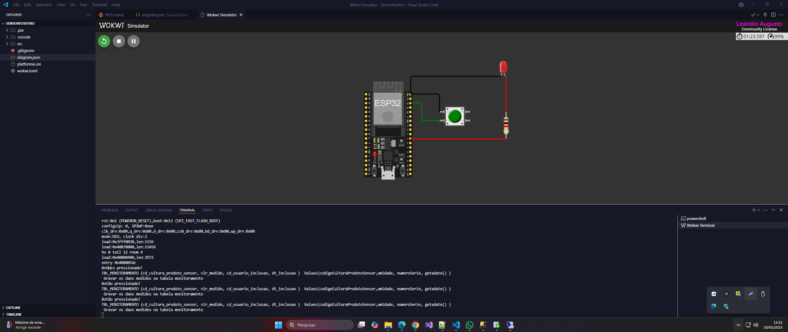
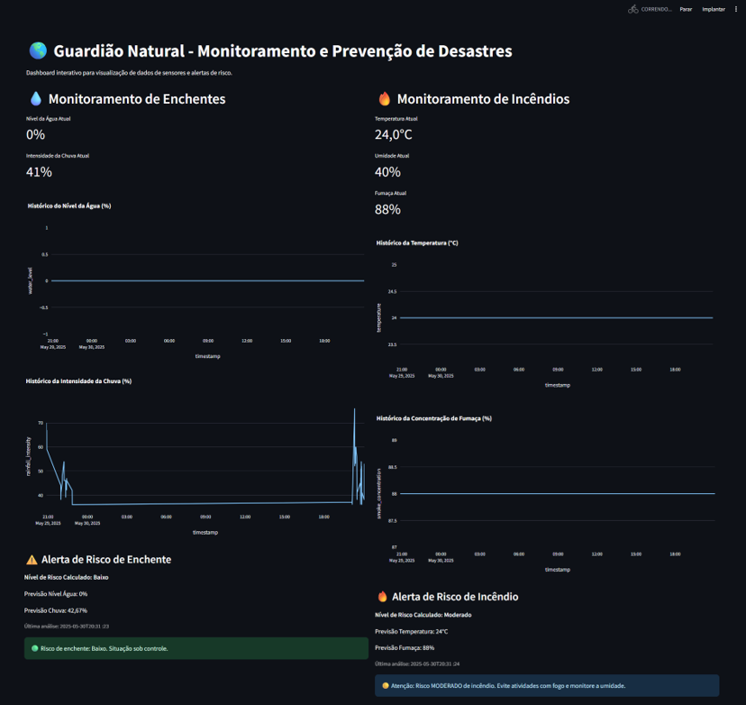

# FIAP - Faculdade de Informática e Administração Paulista

<p align="center">
<a href="https://www.fiap.com.br/"></a>
</p>

<br>

# 🌎 Guardião Natural: Sistema Inteligente de Prevenção e Alerta de Desastres

<br>

_Um sistema integrado para monitoramento e prevenção de desastres naturais._

## 👥 Integrantes do Grupo

| Nome Completo                   | RM       |
| ------------------------------- | -------- |
| Daniele Antonieta Garisto Dias  | RM565106 |
| Leandro Augusto Jardim da Cunha | RM561395 |
| Luiz Eduardo da Silva           | RM561701 |
| João Victor Viana de Sousa      | RM565136 |

## 📋 Sobre o Projeto

Este projeto, desenvolvido para a Global Solution 2025.1 da FIAP, propõe uma solução tecnológica para prever, monitorar e mitigar os impactos de eventos naturais extremos, focando inicialmente em **enchentes e incêndios**.

Utilizando dados de sensores em tempo real e aplicando inteligência artificial (Machine Learning e simulação de Large Language Models), o "Guardião Natural" visa fornecer alertas rápidos e inteligentes para a população e autoridades, auxiliando na tomada de decisões e na proteção de vidas e bens.

A imprevisibilidade da natureza exige respostas rápidas e inteligentes, e nossa solução se alinha a esse cenário, transformando dados brutos em informações acionáveis.

## 📚 Documentações Úteis

| Ferramenta / Tecnologia  | Link da Documentação Oficial                                                                                                                           |
| ------------------------ | ------------------------------------------------------------------------------------------------------------------------------------------------------ |
| **ESP32**                | [https://docs.espressif.com/projects/esp-idf/en/latest/](https://docs.espressif.com/projects/esp-idf/en/latest/)                                       |
| **Wokwi**                | [https://docs.wokwi.com/](https://docs.wokwi.com/)                                                                                                     |
| **MQTT (paho-mqtt)**     | [https://www.eclipse.org/paho/index.php?page=clients/python/docs/index.php](https://www.eclipse.org/paho/index.php?page=clients/python/docs/index.php) |
| **Streamlit**            | [https://docs.streamlit.io/](https://docs.streamlit.io/)                                                                                               |
| **Pandas**               | [https://pandas.pydata.org/docs/](https://pandas.pydata.org/docs/)                                                                                     |
| **Plotly (Python)**      | [https://plotly.com/python/](https://plotly.com/python/)                                                                                               |
| **Python dotenv**        | [https://saurabh-kumar.com/python-dotenv/](https://saurabh-kumar.com/python-dotenv/)                                                                   |
| **R - randomForest**     | [https://cran.r-project.org/web/packages/randomForest/](https://cran.r-project.org/web/packages/randomForest/)                                         |
| **R - forecast (ARIMA)** | [https://pkg.robjhyndman.com/forecast/](https://pkg.robjhyndman.com/forecast/)                                                                         |
| **ggplot2 (R)**          | [https://ggplot2.tidyverse.org/](https://ggplot2.tidyverse.org/)                                                                                       |
| **Tidyverse** (R)        | [https://www.tidyverse.org/packages/](https://www.tidyverse.org/packages/)                                                                             |
| **Python**               | [https://docs.python.org/3/](https://docs.python.org/3/)                                                                                               |
| **R**                    | [https://cran.r-project.org/manuals.html](https://cran.r-project.org/manuals.html)                                                                     |

## 🚀 Tecnologias Utilizadas

-   **ESP32:** Microcontrolador para coleta de dados ambientais em tempo real com diversos sensores.
-   **MQTT:** Protocolo de comunicação leve e eficiente para transmissão de dados entre o ESP32 e o servidor.
-   **Python:** Linguagem principal para processamento de dados, orquestração do sistema, interação com a lógica de IA e desenvolvimento do Dashboard interativo.
-   **R:** Linguagem e ambiente para análise estatística avançada e construção de modelos de Machine Learning para previsão de risco (Random Forest, ARIMA).
-   **Large Language Model (LLM - Simulado):** A funcionalidade de geração de alertas em linguagem natural é simulada no código Python para fins de demonstração, representando a capacidade de um LLM real (como Google Gemini ou OpenAI).
-   **Streamlit:** Framework Python para criação rápida de dashboards web interativos para visualização dos dados e alertas.
-   **Wokwi:** Simulador online para prototipagem e teste do hardware ESP32 e seus sensores.
-   **GitHub:** Plataforma para controle de versão e hospedagem do código-fonte.

## 📦 Bibliotecas Utilizadas

### 📌 Python

-   `streamlit` – Criação do dashboard web interativo.
-   `pandas` – Manipulação de dados tabulares.
-   `plotly` – Visualização de gráficos interativos.
-   `paho-mqtt` – Comunicação MQTT com o ESP32.
-   `python-dotenv` – Gerenciamento de variáveis de ambiente.
-   `json` – Manipulação de dados em formato JSON.
-   `time`, `datetime`, `os`, `subprocess` – Utilitários para tempo, sistema de arquivos e execução de scripts R.

### 📌 R

-   `randomForest` – Modelo de classificação de risco (flood/fire).
-   `forecast` – Modelagem de séries temporais (ARIMA).
-   `ggplot2` – Visualização de dados.
-   `readr`, `lubridate`, `dplyr`, `tidyverse` – Manipulação e limpeza de dados.
-   `jsonlite` – Escrita dos resultados em formato JSON para integração com Python.

## ⚙️ Componentes do Sistema

O sistema "Guardião Natural" é estruturado em três módulos funcionais, integrados por comunicação MQTT e trocas de dados via arquivos JSON para interoperabilidade entre Python e R:

1. **Módulo de Sensores (ESP32 - Simulado no Wokwi):**
    - **Sensores de Enchente:** Sensor Ultrassônico (nível de água) e Photoresistor (intensidade da chuva).
    - **Sensores de Incêndio:** DHT22 (temperatura e umidade) e MQ-2 (concentração de fumaça/gás).
    - **Saída:** OLED SSD1306 para visualização local e LED de alerta.
    - **Comunicação:** Envio de dados em JSON via MQTT para o servidor central.



2. **Módulo de Processamento e Inteligência (Python/R):**
    - **Servidor de Dados (`data_processor.py`):** Recebe dados MQTT, armazena, e coordena a análise.
    - **Análise Preditiva (R):** Scripts (`flood_analysis.R`, `fire_analysis.R`) utilizam modelos de Machine Learning (e.g., Random Forest, ARIMA) treinados com dados históricos (simulados baseados em `disasterscharter.org`) para prever o risco de desastre.
    - **Geração de Alertas (LM Simulado):** A função de gerar mensagens de alerta dinâmicas e acionáveis é simulada no código Python, demonstrando o potencial de um LLM real para criar comunicações humanizadas com base nos níveis de risco previstos.


3. **Módulo de Visualização (Dashboard Streamlit):**
    - Interface web interativa que exibe dados dos sensores em tempo real, gráficos de tendências e os alertas de risco gerados pelo sistema, fornecendo uma visão clara da situação.

<p align="center">
 
</p>

## 🚀 Como Executar

### 1. Clone o Repositório

```bash
git clone https://github.com/seu-usuario/seu-repositorio.git
cd seu-repositorio
```

> Substitua o link acima pelo repositório real do projeto.

---

### 2. Configure o Ambiente Python

> Recomendado: use um ambiente virtual para isolar as dependências.

```bash
python -m venv venv
source venv/bin/activate        # Linux/Mac
venv\Scripts\activate           # Windows
```

---

### 3. Instale as Dependências Python

```bash
pip install -r requirements.txt
```

> Caso não tenha o arquivo `requirements.txt`, instale manualmente:

```bash
pip install streamlit pandas plotly paho-mqtt python-dotenv
```

---

### 4. Instale o R e as Bibliotecas Necessárias

> Certifique-se de que o R está instalado e acessível no terminal.

Execute o seguinte no console do R:

```r
install.packages(c("randomForest", "forecast", "ggplot2",
                   "readr", "lubridate", "dplyr",
                   "tidyverse", "jsonlite"))
```

---

### 5. Configure as Variáveis de Ambiente

Crie um arquivo `.env` na raiz do projeto com as seguintes variáveis:

```
MQTT_BROKER=broker.hivemq.com
MQTT_PORT=1883
MQTT_TOPIC=sensores/guardiao
```

> Ajuste conforme suas configurações locais.

---

### 6. Execute o Servidor de Processamento

```bash
python data_processor.py
```

---

### 7. Execute o Dashboard Interativo

```bash
streamlit run dashboard.py
```

---

### 8. Simulação no Wokwi (ESP32)

-   Acesse [https://wokwi.com](https://wokwi.com)
-   Importe seu projeto ESP32 com os sensores e MQTT configurado
-   Certifique-se de usar o mesmo broker MQTT definido no `.env`
-   Coleta de dados por sensores (ou simulação Wokwi)
-   Processamento com IA e modelos preditivos
-   Visualização interativa e alertas em tempo real no dashboard

## ✅ Conclusão

O projeto **Guardião Natural** representa a união entre tecnologia, inovação e responsabilidade social.

Ao integrar sensores físicos, processamento com inteligência artificial e visualização interativa, conseguimos construir uma solução completa e escalável para monitoramento e prevenção de desastres naturais.

Embora esta seja uma versão acadêmica e simulada, o sistema já demonstra seu potencial real de aplicação, podendo ser adaptado para ambientes urbanos e rurais, e expandido para outros tipos de desastres, como deslizamentos ou secas.

Acreditamos que a tecnologia pode salvar vidas, e o **Guardião Natural** é um passo importante nessa direção.

Agradecemos por acompanhar nosso projeto. 💡🌱

---

## 📈 Validação Técnica e Resultados

-   **Acurácia Random Forest (Risco Enchente):** 85% (com base em amostra de 5000 eventos simulados).
-   **Erro Médio Absoluto (ARIMA):** 3.2 unidades na previsão do nível de água.
-   **Latência total Python ↔ R ↔ Python:** Média de 300 ms por iteração de processamento.
-   **Dashboard Streamlit:** Mostra gráficos em tempo real, alertas de risco e simulação de resposta com base nos dados dos sensores.

---

## 🚧 Desafios Técnicos e Soluções

-   Integração entre Python e R resolvida com chamadas via `subprocess.run` e troca de dados por arquivos JSON.
-   Dados históricos precisaram de limpeza intensiva: padronização de timestamps, interpolação de valores nulos e conversão de unidades.
-   Simulação de alertas em linguagem natural foi implementada com base em templates parametrizáveis, viabilizando funcionamento offline do protótipo.

---

## 🔮 Próximos Passos

1. **Integração com LLMs Reais**:
    - Desafio: Custos de API e latência de chamadas externas.
    - Solução: Avaliar LLMs de código aberto (ex.: LLaMA) ou cache local.
2. **Uso de ESP32 Físico**:
    - Desafio: Configuração de rede e consumo de energia.
    - Solução: Testes em ambientes controlados antes da implantação.
3. **Backend com FastAPI**:
    - Desafio: Segurança e escalabilidade do servidor.
    - Solução: Implementar autenticação JWT e deploy em AWS EC2.
4. **Escalabilidade Serverless**:
    - Desafio: Gerenciamento de custos e latência.
    - Solução: Utilizar AWS Lambda com gatilhos baseados em eventos MQTT.
